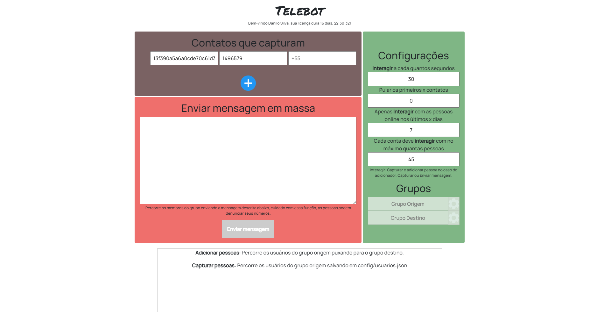
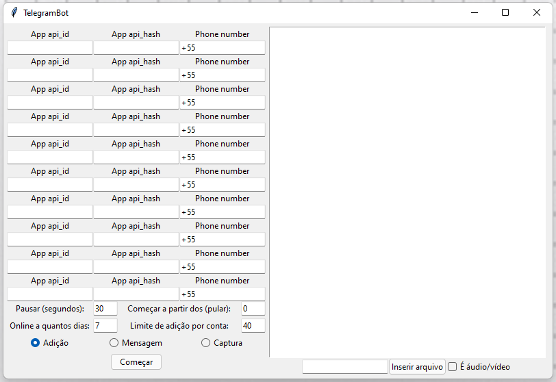
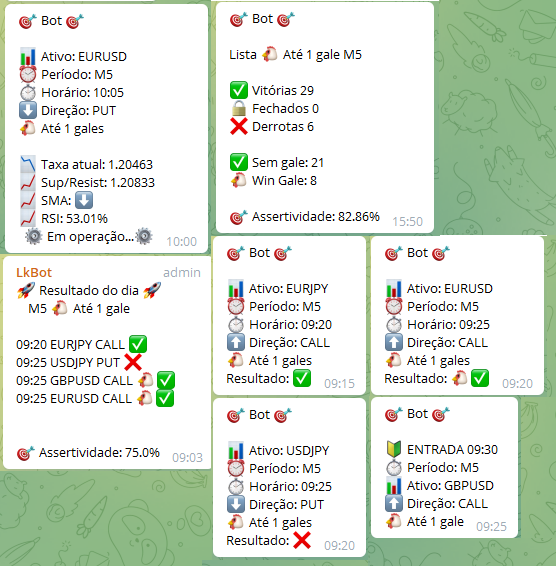
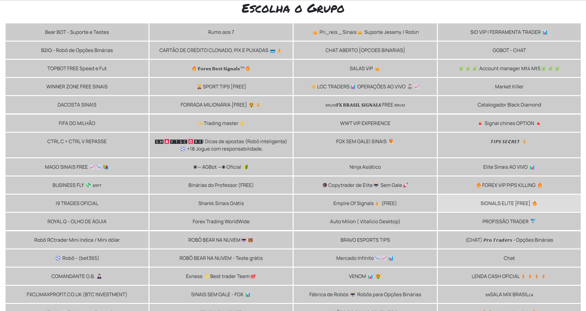
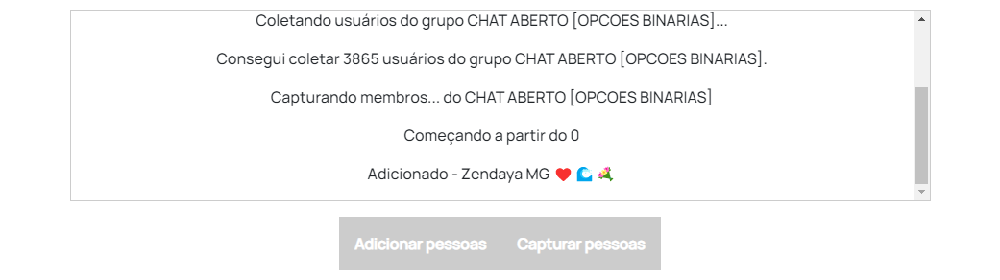

# Telebot 2
    
> Telegram bots to invite people from mega groups and channels and so on.

<p align="center">
  
</p>

This repository is a collection of telegram bots that can invite people, send programmed messages, copy messages and so on. Important to note: **The limit of add each day is 40**, more than it will be blocked by spam.

 - [x] Google OAuth 2.0 and [licensor](https://github.com/JDaniloC/Individual-Licenciador) integration. (Optional, can be disabled)
 - [x] Can get the telegram API and Hash ID automatically from given number.
 - [x] Can send messages to each contact from a group or channel.
 - [x] There are settings to avoid spam block: Interact with X people with Y seconds between them.
 - [x] Logs field and catalogued errors with easy understanding.
 - [x] Created using Eel to connect async python to HTML/CSS/JS interface.


## How to use

Install Python 3.7 or higher and run the following command to install the dependencies:

```bash
pip install -r requirements.txt
```

Enter the desired folder and run: `python bot.py` or `python telebot.py`

To run telebot2 with the web interface:
```bash
python -m eel telebot.py web -F -w -i web/images/favicon.ico
```

### Google OAuth 2.0 (Optional)
By default, telebot2 uses Google OAuth 2.0 authentication and license validation. To configure:

1. Create a project in the [Google Cloud Console](https://console.cloud.google.com/).
2. Enable the "Google+ API" and create OAuth 2.0 credentials.
3. Download the JSON credentials file and configure it as in `telebot2/admin/gerador.py`.
4. Run `gerador.py` to generate the encrypted `data.dll` file in `telebot2/config/`.

#### Disable Google OAuth and/or licensor authentication
You can disable each feature independently by setting environment variables:

- To disable both OAuth and license check:
  ```bash
  export TELEBOT2_DISABLE_AUTH=1
  export TELEBOT2_DISABLE_OAUTH=1
  ```
- To disable only OAuth (and keep license check):
  ```bash
  export TELEBOT2_DISABLE_OAUTH=1
  ```
- To disable only license check (and keep OAuth):
  ```bash
  export TELEBOT2_DISABLE_AUTH=1
  ```

Or, edit the code and set the flags `DISABLE_AUTH` and/or `DISABLE_OAUTH` at the beginning of the file `telebot2/telebot.py`.

This way, the bot will work without license validation and/or Google login as you prefer.

## Telebot v.1



The first version of telebot can add, send messages, files (images, audio or video), with the same settings as the second version, but built using TKinter, and the "logs panel" is the terminal. It's used if telebot2 doesn't add anyone.

>> Different from version 2: The licensor found in the admin/ folder generates a file with the license days.

 - Sleep for X seconds after add settings.
 - Skip the first X contacts from the group.
 - Add only contacts who were online in the last X days.
 - Only add X contacts in this session.

> At least 10k contacts were added in two groups using this version, through more than 10 telegram accounts.

## Other bots



### MetaSender
Reads the MQL return file and sends the messages to X groups, sends a partial result (with tendency analysis like SMA, RSI and the closest support/resistance) and full result when the trades are completed.

### ListSender
Can schedule a list of trades to be sent to X groups 5 minutes before the trade, sends a partial (with tendency analysis like SMA, RSI and the closest support/resistance) and full result when the trades are completed, verifies if the asset is open before starting the trade, and can specify many lists simultaneously up to 2 Gales and M30.

The commands are:
- Registrar nova lista: Register a new list.
- Ver listas registradas: Show the registered lists.
- Começar transmissão: Start the transmission from the registered list.
- Parar transmissão: Stop the transmission from the transmission list.
- Adicionar novo grupo: Ready the bot to wait the user put the bot in a new group to add in the queue of groups to send the messages. 
- Desligar bot: Get out from the loop, exiting the bot.

### 

<p align="center">
    
    
</p>
